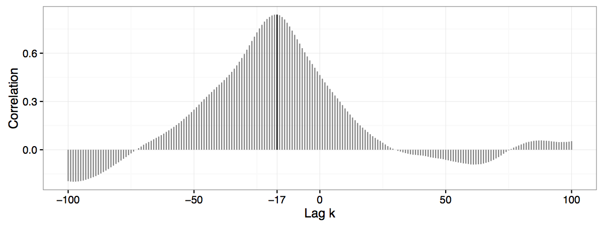

## Automatic Matching of Bullet Lands


<p class="black">
Eric Hare, Heike Hofmann, Alicia Carriquiry<br/>
Center for Statistics and Applications in Forensic Evidence (CSAFE)<br/>
Iowa State University
</p>

```{r,echo=FALSE, message=FALSE,warning=FALSE}
library(x3pr)
library(x3prplus)
library(ggplot2)
library(knitr)
```

## Goal

- We wish to determine whether two bullets were fired from the same gun barrel
- Striation patterns are unique to barrels and fairly stable
- Forensic Examiners shoot bullets from guns of suspects, compare it to bullet from crime scene


## Current Practice

- Traditionally, the bullets are placed under comparison microscopes
- They are manually aligned by forensic scientists and compared
- Thresholds have been established as "standard practice"
- However, this has traditionally been less than statistical

The problems culminated in a 2009 NAS report which found, among other things, *"much forensic evidence -- including, for example, bite marks and firearm and toolmark identification is introduced in criminal trials without any meaningful scientific validation, determination of error rates, or reliability testing to explain the limits of the discipline."*

## James Hamby Study

- Ten consecutively rifled Ruger P-85 pistol barrels used to fire 20 "known" test bullets and 15 "unknown" bullets for comparison
- Sets of 35 bullets sent to 507 Forensic Examiners for examination
- 0 false positive identifications, 8 inconclusive results (out of 7605)

```{r, eval=FALSE}
plot3D.x3p.file(read.x3p("~/GitHub/imaging-paper/
app/images/Hamby252_3DX3P1of2/Br1 Bullet 1-1.x3p"),
plot.type = "surface")
```
    
## Data Format

- 3D topographical images of each bullet
- x3p format, array of surface measurements at the micrometer level
- R package x3pr available for working with these images (Nicholas Petraco, John Jay College)
- R package x3prplus is our additional functions to perform this analysis
- Each bullet is a set of 6 land-to-land scans


## Procedure

The basic procedure can be described as follows:

1. Extract a profile at a fixed bullet height
2. Identify and remove the grooves from that profile
3. Fit a loess regression to the remaining profile (called the signature)
4. Get the residuals from this regression
5. Identify peaks and valleys in residuals
6. Extract features from the residuals
7. Use these features in a random forest to predict matches

## Step One: Extract a Profile

We need to choose a location (height) of the bullet at which to extract a profile. To do so:

1. Extract a profile near the base of the bullet, call this value $d_0$.
2. Take a fixed step $d$ and extract at $d + d_0$.
3. Check the cross correleation (CCF) between the signature at $d_0$ and at $d + d_0$.
4. If this CCF exceeds a threshold (0.9 in our case), choose $d_0$ as the signature
5. Otherwise, repeat steps 2 to 4 for $d$, $2d$, $3d$, ... until the threshold is achieved.

## Step One (Continued)

```{r, warning=FALSE}
br111 <- get_crosscut("images/Br1 Bullet 1-1.x3p", x = 243.75)

qplot(y, value, data = br111) + theme_bw()
```

## Step Two: Remove Grooves

1. At a fixed height $x$ extract a bullet's profile (previous figure, with $x = 243.75\mu m$).
2. For each $y$ value, smooth out any deviations occurring near the minima by twice applying a rolling average with a pre-set \emph{smoothing factor} $s$.
3. For each smoothed $y$ value, compute another rolling average using the same smoothing factor as above.
4. Determine the location of the peak of the left groove by finding the first doubly-smoothed value $y_i$ that is the maximum within its smoothing window. (Similar for valley of left groove).

## Identifying Grooves (Easy)

```{r, message=FALSE, warning=FALSE}
br111.groove <- get_grooves(br111)
br111.groove$plot
```

## Identifying Grooves (Challenging)

```{r, message=FALSE, warning=FALSE}
result2 <- get_grooves(get_crosscut("~/GitHub/imaging-paper/app/images/Hamby252_3DX3P1of2/Br1 Bullet 1-6.x3p"))
result2$plot
```

## Step Three: Fit Loess Regression

```{r, warning=FALSE}
br111.loess <- fit_loess(br111, br111.groove)
br111.loess$fitted
```

## Step Four: Get the Residuals

```{r, warning=FALSE}
br111.loess$resid
```

## Step Five: Peaks and Valleys

```{r, warning=FALSE}
br111.peaks <- get_peaks(br111.loess$data)
br111.peaks$plot
```

## Step Six: Extract Features

```{r,echo=FALSE,message=FALSE,warning=FALSE}
library(dplyr)

mypaths <- c("images/Br1 Bullet 1-1.x3p", "images/Br1 Bullet 2-3.x3p")
my_bullets <- lapply(mypaths, function(x) {
    result <- read.x3p(x)
    result[[3]] <- x
    names(result)[3] <- "path"
        
    return(result)
})
bullets_processed <- lapply(my_bullets, function(bul) {
    processBullets(bullet = bul, name = bul$path, x = 243.75)
})
names(bullets_processed) <- mypaths

bullets_smoothed <- bullets_processed %>% bind_rows %>% bulletSmooth

br111 <- filter(bullets_smoothed, bullet == mypaths[1])
br123 <- filter(bullets_smoothed, bullet == mypaths[2])
```

- Maximal number of CMS (consecutive matching striae), and, similarly, the number of consecutively non-matching striae (CNMS), 
- Number of matches and non-matches,
- CCF (Cross-Correlation Function)
- Average difference $D$ between signatures, defined as the Euclidean vertical distance between surface measurements of aligned signatures.
- The sum $S$ of average absolute heights of matched extrema

## Consecutively Matching Striae (CMS)

11 CMS


## Cross Correlation Function (CCF)



## Distribution of Features


## Step Seven: Random Forest


## Feature Importance


## Reminder: List of Features

- Maximal number of CMS (consecutive matching striae), and, similarly, the number of consecutively non-matching striae (CNMS), 
- Number of matches and non-matches,
- Average difference $D$ between signatures, defined as the Euclidean vertical distance between surface measurements of aligned signatures.
\[
D^2 = \frac{1}{\text{\#}t}\sum_t \left[f(t) - g(t)\right]^2,
\]
- The sum $S$ of average absolute heights of matched extrema
- Cross Correlation Function (CCF)

# Question: Which features depend on the length of the signature?

## Improvement: Scaling Features

Scale each feature dependent on the length by the length of the signature

- CMS per micrometer
- Matches per micrometer
- ...
- Also include the length of the signature as a feature

## Web Application

https://erichare.shinyapps.io/x3prplus

## Future Work

- We are extremely limited by data here - Currently we've only assessed this algorithm on one particular set of 35 bullets
- There is likely an effect from the equipment used to scan the bullets, or the person performing the scan
- We need to assess the quality of the algorithm in case we don't have full bullet lands available, as is the case in many forensics applications

## Thank You

Special thanks to Alan Zheng at the National Institute of Standards and Technology for maintaining the NIST Ballistics Toolmark Research Database and providing many useful suggestions for our algorithm.

- My GitHub: https://github.com/erichare
- Project GitHub: https://github.com/heike/x3prplus
- Web Application: https://erichare.shinyapps.io/x3prplus

Any Questions?
