## Slides
Slides are available at: http://erichare.me/x3prproto/slides.html

Installation guide at: http://erichare.me/x3prproto/instructions.html


## Bullets and cartridges
CSAFE sponsored project in the beginning stages


word of caution: we still do not have any results to show (yet)


First view of bullet matching from data exploration point of view
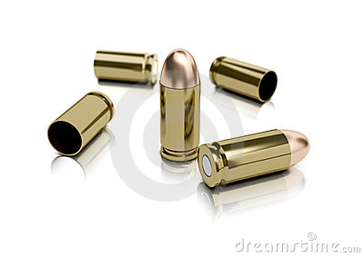

## Bullets images
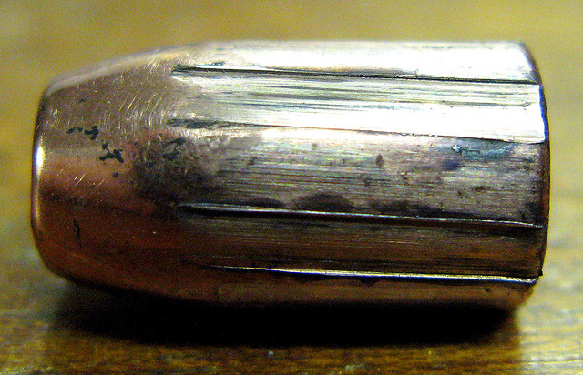

## Rifling
traditional rifling for a 9 mm handgun barrel
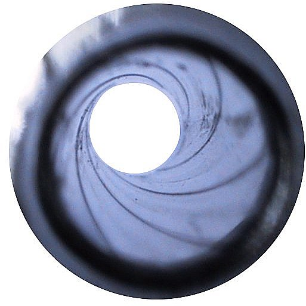
 
## Matching bullets

premise for matches: striation patterns are unique to barrels and fairly stable 

for matches: FEs shoot bullets from guns of suspects, compare it to bullet from crime scene

Match of two bullets under the microscope: 


With high resolution 3d scanners digital images of bullets can be taken ... needs special data format ...

## Open Forensic Metrology Consortium


The OpenFMC (Open Forensic Metrology Consortium) is a group of academic, industry, and government Firearm Forensics researchers whose aim is to establish file formats, means of data exchange, and best practices for researchers using metrology in the forensic sciences 

http://www.openfmc.org

The group's first action was the adoption of the X3P file format for the exchange of metrology data.

## x3p format
* Format for Firearm Forensics data
* Used for storing surface topographies measured in standard units
* Open format, originally developed by openGPS community
* 10x smaller than a text file version of the same data

As a bonus... there are currently two libraries available for working with x3p. One in C++, and one in... you guessed it...

## x3pr
* Contributed by Nick Petraco, John Jay College
* Functions to read and parse x3p files
* Functions to produce 3D surface plots of the resulting data
* Available on GitHub

Let's see if we can get installed...

## plot3D rgl Demo
Follow the instructions at:

http://erichare.me/x3prproto/instructions.html

## NIST database
NIST maintains a Ballistics Toolmark Database, with three-dimensional topography data provided in the X3P data format:

http://www.nist.gov/forensics/ballisticsdb/ballistics-datasets.cfm

We are going to explore the Hamby Study.

## James Hamby Consecutively Rifled Ruger Barrel Study (2001 - 2009)

10 barrels, 2 test bullets for each barrel

15 `unknown' bullets for comparison

Sets of physical bullets matched by forensic experts (error < 0.1%)

The idea here: compare ***pictures*** of the bullets for comparison


## Reading x3p in R

Also install package ```x3prplus``` using ```devtools::install_github("heike/x3prplus")```

```{r, message=FALSE, warning=FALSE}
library(x3prplus)
library(x3pr)
file.path <- system.file("extdata", "Br1 Bullet 1-3.x3p", 
                         package = "x3prplus")
land.x3p <- read.x3p(file.path)
land <- fortify_x3p(land.x3p)
head(land)
```

## Comparing pictures of bullets

each bullet is scanned six times, from one groove to the next (about 70$^\circ$)

       


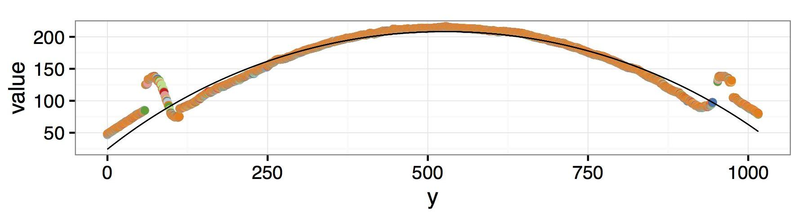


## Fitting Curves to Bullets

Assume variables X and Y are on circle. 

Find radius $r$, and origin $(x_0, y_0)$ to minimize the expression:

$\sum_{i=1}^n \left( (x_i - x_0)^2 + (y_i - y_0)^2 - r^2\right)^2$


## Residuals of circular fit


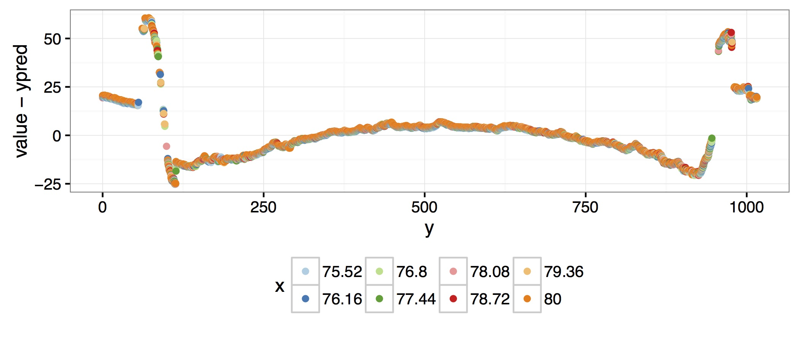

## Overview of Bullets from Barrel 5

All lands of bullet 1

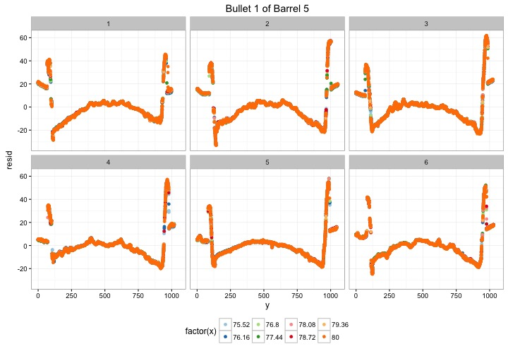

## Overview of Bullets from Barrel 5

All lands of bullet 2

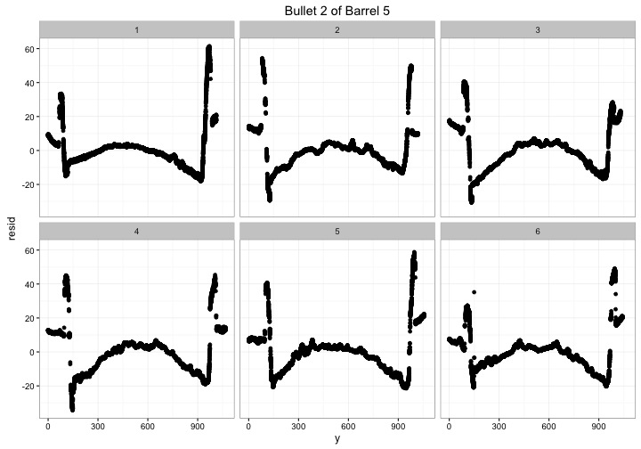


## Barrel 5

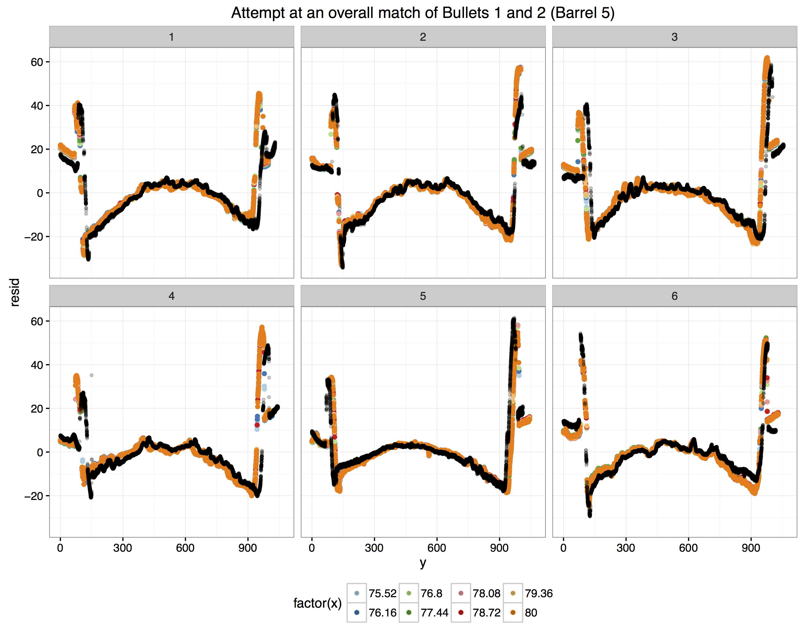

## Actual matches
range of matches between test bullets is between picture perfect and fairly doubtful

## Barrel 3

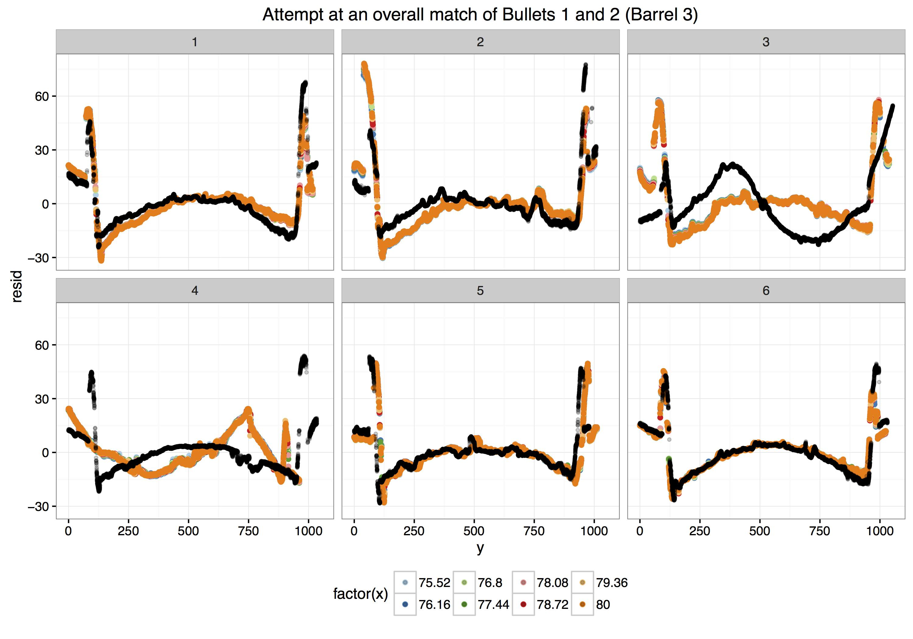

## Barrel 6

... what is going on with these bullets ... ?

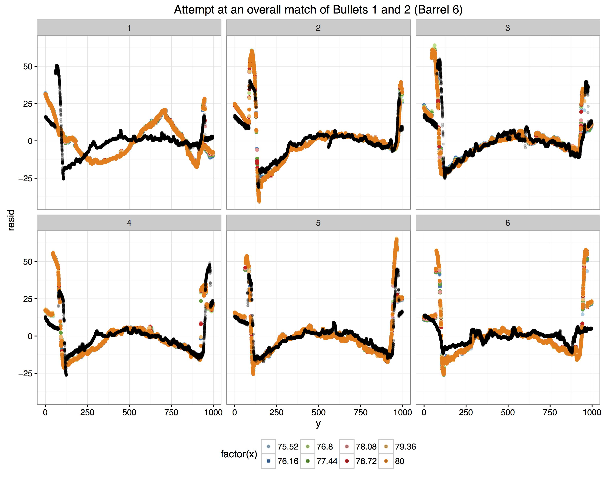

## Barrel 6

look at scans directly - use bullet6-scans.R 

## Barrel 6, different cross section

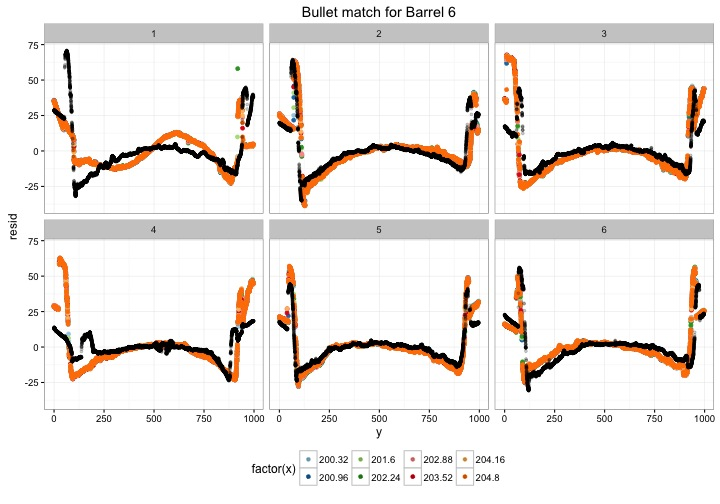


## Open questions / Possible next steps

- how much matching circumference is enough for an overall match? -- what is common practice for FE?

- (naive) correlation between scans is high, no matter whether scans match or not ... doesn't help with identifying which scans match

- visual inspection of residual plots seems like a good start (remember, we only inspect a 0.1 mm cross section of a bullet) to investigate whether lay people are able to find matches

## Where do the lines match the best?


study at [https://bill.shinyapps.io/turk20]

## Additional Information
Bullet Signature Identification Using Topography Measurements and Correlations; the Unification of Topographic and Mathematical Comparisons

http://www.nist.gov/oles/upload/11-Thompson-Robert-NIST-Consecutive-Barrel-Bullet-Comparison.pdf
